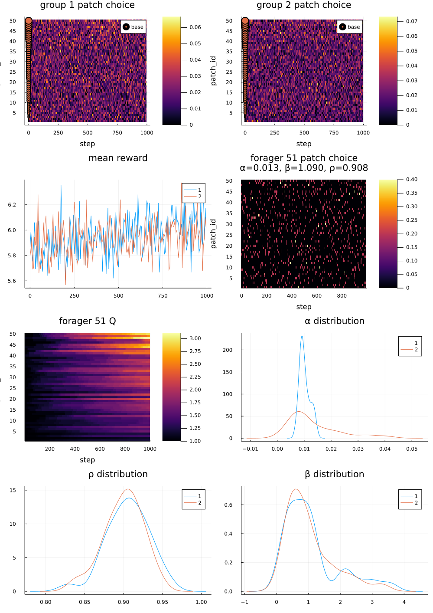
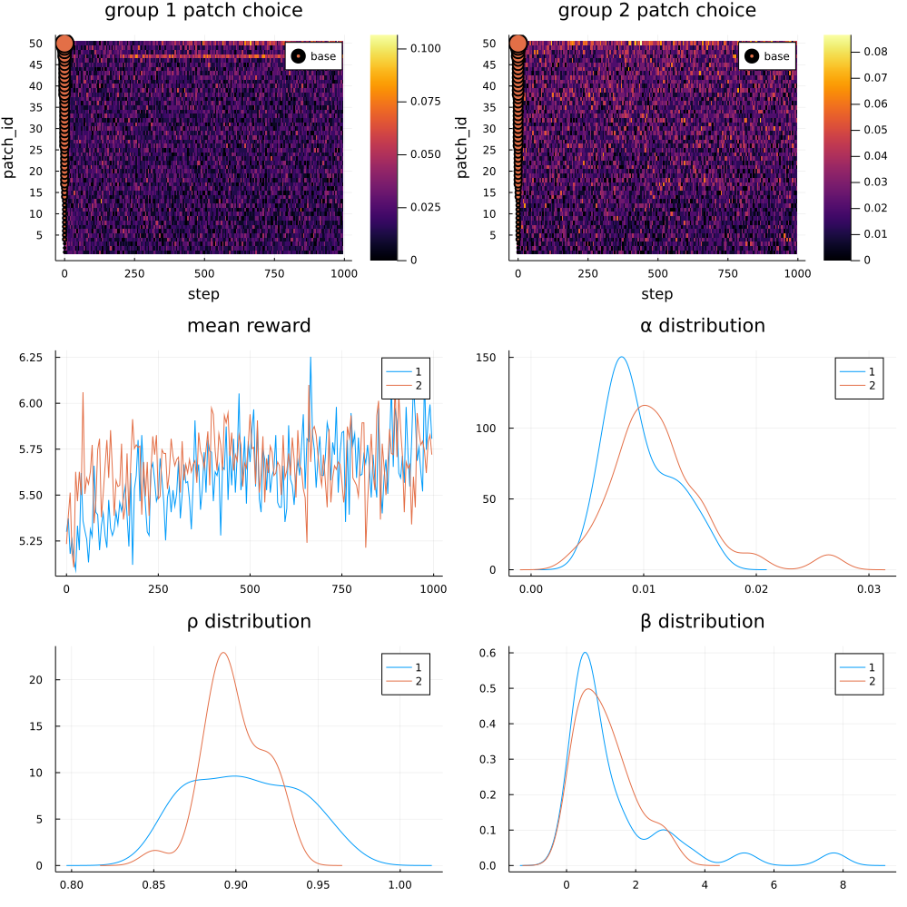
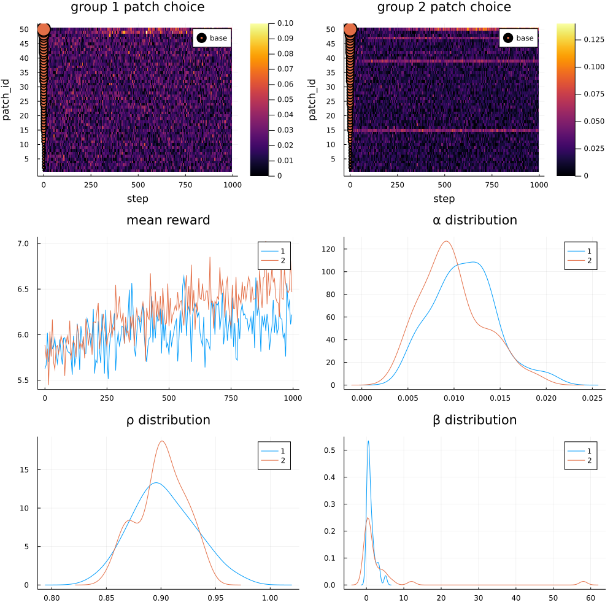
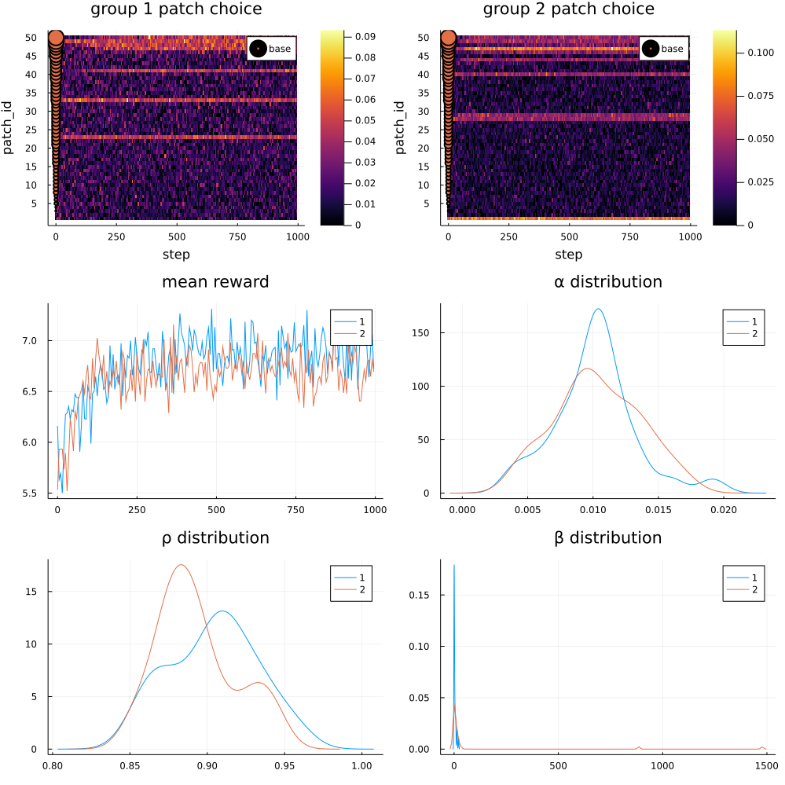
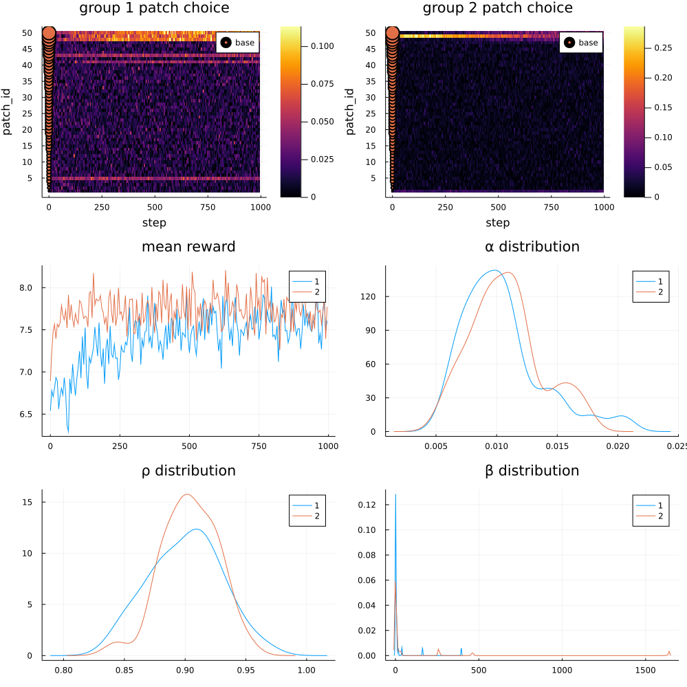

<!-- requirement: word count 4000, 15 pages -->

# Introduction
Individuals are diverse in their decision-making preferences. Much research has been devoted to study delay discounting, the discounting of future rewards relative to present rewards. Interpersonal disparities in delay discounting is stable over the life course, and high level of delay discounting is moderately correlated with lower income, lower intelligence, and lower connectivity strength of inhibitory corticostriatal tracts (@keidel2021). Research on risk preferences shows that general risk tolerance is slightly genetically correlated with household income and that genes near correlated SNPs are associated with genes for glutamate and GABA neurotransmitters (@23andme2019). These studies focus on the genetic and cognitive causes and behavioral effects of individual decision-making preferences. This research attempts to illustrate how within-group diversity in decision-making preferences (and other parameters) may provide a competitive advantage against more homogeneous groups. Previously, @hong2004 showed that a functionally diverse group outperforms a group of less diverse people with higher overall ability; they also proved a mathematical theorem to that effect. In that simulation, the goal is to maximize a real-valued function of solutions; the agents are diverse in their perspectives, their internal representations of solutions, and heuristics, their search strategies in the solution space. 

# Methods
We use Agents.jl (@Agents.jl, https://github.com/JuliaDynamics/Agents.jl), an agent-based modeling (ABM) library to model foragers and food source patches. ABM can implement any complex interaction of individual agents, investigate the evolution of the model and inspect its state at any instant. ABM can better represent non-linearity and heterogeneity of real interactions than systems of different equations (@bankes2002) and is suited to study emergence (@macy2002).

In our model, foragers seek to gather food. The forager scales the reward by a utility exponent $U=reward^\rho$, which accounts for risk tolerance. Foragers with higher $\rho$ are more risk tolerant because exponential functions are concave for $\rho$ less than 1. Each forager has an internal representation of the subjective quality/utility of all patches, $Q[i]$ for patch $i$, which is updated via Q-learning: $Q[i]\mathrel{+}=\alpha(U-Q[i])$. Foragers may also learn from others' experiences. Higher learning rate $\alpha$ results in quicker learning. At each decision step, a forager selects from the patches with probabilities based on $Q[i]$. First, $Q[i]$ is divided by the maximum of all patches. Then, a softmax function is applied to transform them to probabilities $P(\text{select patch } i)=\frac{e^{\beta Q'[i]}}{\sum_ie^{\beta Q'[i]}}$. Higher softmax temperature $\beta$ causes more exploitation and less exploration. The initial maximum-normalization of $Q[i]$ is required to separate the exploitation v. exploration dimension from risk tolerance. The foragers visit their selected patches in the order determined by their speed rank. A patch rewards incoming foragers based on a sinusoidal function of the number of foragers visiting it: $reward = \frac{base}{1 + e^{decay*(n_\text{faster} - capacity)}}$, where $n_\text{faster}$ is the number of foragers who visited this patch before this forager.

The foragers are diverse in their learning rates, their softmax temperatures and their utility exponents. In a group of foragers, all of these parameters sample from log-normal distributions to ensure proper ranges. The patches have diverse $base$ from a Poisson distribution, but their $capacity$ and $decay$ are fixed.

The source code is available at https://github.com/xiruizhao/foraging_abm

# Results
1. Diversity in learning rate

2. Group 2 enabled in-group communication about the quality of patches

3. Diversity in softmax temperature
    1. low range
    

    2. high range
    

    3. high range, group 2 enabled communication
    

# Discussion
Contrary to expectation, diversity in learning rates did not improve group performance in the tested parameter. It was hypothesized that slow learners might counteract the stochasticity introduced by the sinusoidal function that decreases rewards as the number of visiting foragers increases. Unsurprisingly, in-group communication helped the group learn faster. 
Variance in softmax temperature presented interesting results. When variance is relatively low for both groups, a slightly more diverse group will have more members more exploitative and achieve a better balance against exploration. When variance is relatively high for both groups, the more varied group is penalized for having excessively exploitative members who fail to gather enough information to learn about all the patches. However, this penalty is overcome by enabling communication. This result is in line with research on division of labor. In this case, some members are relegated to the role of explorers and others exploiters. @beshers2001 discussed some mechanisms for division of labor in social insects: 1) diverse response thresholds to external stimuli, 2) self-reinforcement of successful experiences and 3) information transfer. The mechanism shown here is information transfer combined with diverse internal decision-making parameters, similar to response thresholds.

One important limitation of this research is that diversity is not numerically measured. As the case of softmax temperature illustrates, it's incorrect to identify diversity with the variance of the log-normal distribution because higher variance leads to higher mean in that case. Since the softmax temperature incorporates into the decision-making process nonlinearly, it's unclear what function of it should be held constant while its variance is increased. In addition, this research did not consider the effect of diversity in risk tolerance or delay discounting because it was difficult to incorporate them in a simple model. Presumably, risk intolerance in the gain domain is rational when there agents have to for example, meet a daily quota. We can introduce variance in patch rewards. Other reinforcement learning algorithms can be used to represent reward stochasticity.

# References

